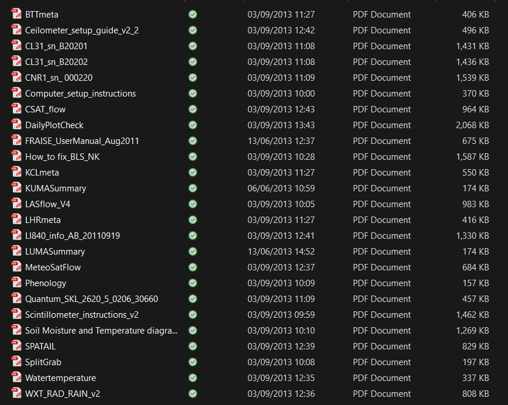
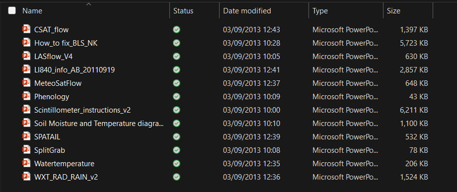

## Operational Instructions

### pdf

| where |  what |
| -- | --|
| OperationalInstructions/pdf/BTTmeta.pdf |    |
| OperationalInstructions/pdf/Ceilometer_setup_guide_v2_2.pdf |Ceilometer   |
| OperationalInstructions/pdf/CL31_sn_B20201.pdf | Ceilometer: Calibration CL31 Ceilometer (B20201) 29/May/2006 |
| OperationalInstructions/pdf/CL31_sn_B20202.pdf | Ceilometer Calibration: CL31 Ceilometer (B20202) 29/May/2006   |
| OperationalInstructions/pdf/CNR1_sn_ 000220.pdf> 
| OperationalInstructions/pdf/Computer_setup_instructions.pdf |  How to set up a computer for data collection   |
| OperationalInstructions/pdf/CSAT_flow.pdf | Eddy Covariance    |
| OperationalInstructions/pdf/DailyPlotCheck.pdf |    |
| FileFormatSheet.pdf | created from ODS FileFormatSheet.ODS 20/10/24|
| OperationalInstructions/pdf/How_to fix_BLS_NK.pdf | - BLS Dartrey Tower |
| OperationalInstructions/pdf/KCLmeta.pdf |    |
| OperationalInstructions/pdf/KUMASummary.pdf |    |
| OperationalInstructions/pdf/LASflow_V4.pdf |  LAS  |
| OperationalInstructions/pdf/LHRmeta.pdf |    |
| OperationalInstructions/pdf/LI840_info_AB_20110919.pdf |  Li-840  |
| OperationalInstructions/pdf/LUMASummary.pdf |    |
| OperationalInstructions/pdf/MeteoSatFlow.pdf | - Meteosat   |
| OperationalInstructions/pdf/Phenology.pdf |  Phenology    |
| OperationalInstructions/pdf/Quantum_SKL_2620_5_0206_30660.pdf |    |
| OperationalInstructions/pdf/Scintillometer_instructions_v2.pdf |  Scintillometer instructions   |
| OperationalInstructions/pdf/Soil Moisture and Temperature diagram.pdf |Soil Moisture and Temperature diagram|
| OperationalInstructions/pdf/SPATAIL.pdf |  Spatial   |
| OperationalInstructions/pdf/SplitGrab.pdf | SplitGrab instructions How to modify grab on data02    |
| OperationalInstructions/pdf/Watertemperature.pdf |  Water Tinytag  |
| OperationalInstructions/pdf/WXT_RAD_RAIN_v2.pdf | WXT RAD and rain |

### ppt

| where |  what |
| -- | --|
| OperationalInstructions/pptx/WXT_RAD_RAIN_v2.pptx |    | 
| OperationalInstructions/pptx/CSAT_flow.pptx |    |
| OperationalInstructions/pptx/How_to fix_BLS_NK.pptx | BLS Dartrey Tower    |
| OperationalInstructions/pptx/LASflow_V4.pptx | LAS   | 
| OperationalInstructions/pptx/LI840_info_AB_20110919.pptx | Li-840    | 
| OperationalInstructions/pptx/MeteoSatFlow.pptx |    | 
| OperationalInstructions/pptx/Phenology.pptx |  Phenology    | 
| OperationalInstructions/pptx/Scintillometer_instructions_v2.pptx |  Scintillometer instructions   | 
| OperationalInstructions/pptx/Soil Moisture and Temperature diagram.pptx | Soil Moisture and Temperature diagram   | 
| OperationalInstructions/pptx/SPATAIL.pptx | Spatial     |
| OperationalInstructions/pptx/SplitGrab.pptx |  SplitGrab instructions How to modify grab on data02   | 
| OperationalInstructions/pptx/Watertemperature.pptx | Water Tinytag   |

- | ListNetCDF.ods">NetCDF List of Programs</a>

- IRT – InfraRed Thermometer.pdf |    |pptx

<h2></h2>
<table width="640">
<tbody>
<tr>
<td><a href="http://www.met.reading.ac.uk/micromet/flowdiagrams">Flow Diagrams</a></td>
<td><a href="http://www.met.reading.ac.uk/micromet/documents/FileFormats-1.pdf">File Formats</a>
<a href="http://www.met.reading.ac.uk/micromet/documents/FileFormatsheet.ods">(spreadsheet)</a></td>
<td></td>
<td></td>
<td><a href="http://www.met.reading.ac.uk/micromet/documents/oldfileformats.ods">Old File Formats</a></td>
<td></td>
<td></td>
</tr>
<tr>
<td></td>
</tr>
</tbody>
</table>
<table border="1" cellspacing="1" cellpadding="1">
<tbody>
<tr>
<td><a href="http://www.met.reading.ac.uk/micromet/documents/instrumentoverviewcombined.ods"><strong>Instrument</strong></a></td>
<td></td>
<td>Variable</td>
<td>KUMA</td>
</tr>
<tr>
<td>WXT</td>
<td></td>
<td>Tair, WS, Dir, RH, Station Pressure,Precipitation</td>
<td>archive but not yet real time</td>
</tr>
<tr>
<td>Li-840</td>
<td></td>
<td>CO2, H20</td>
<td></td>
</tr>
<tr>
<td>LAS</td>
<td></td>
<td>QH, CN2</td>
<td></td>
</tr>
<tr>
<td>CNR1, UVA, UVB, PAR,</td>
<td></td>
<td>Kdn, Kup,Ldn. Lup, Q*, UVA, UVB, PAR, CNR1 (Temp)</td>
<td>archive but not yet real time, issue: rad peaks</td>
</tr>
<tr>
<td>EC: CSAT, Li7500, KH</td>
<td></td>
<td>u,v,w, qh, Tsonic, QH,QE,FCO2</td>
<td>archive but not yet real time, issue: flux processing</td>
</tr>
<tr>
<td>Ceilometer</td>
<td></td>
<td>cloud height, MLH</td>
<td></td>
</tr>
<tr>
<td>T profile</td>
<td></td>
<td>Tair (KSS)</td>
<td>in progress</td>
</tr>
<tr>
<td>IRT</td>
<td></td>
<td>Surface temperature</td>
<td>in progress</td>
</tr>
<tr>
<td>Meteosat</td>
<td></td>
<td>radiances</td>
<td></td>
</tr>
<tr>
<td>AMDAR</td>
<td></td>
<td>T profile</td>
<td></td>
</tr>
<tr>
<td>Spatial</td>
<td></td>
<td>T,rh,</td>
<td>in progress</td>
</tr>
<tr>
<td>LUMPS</td>
<td></td>
<td>modelled fluxes</td>
<td></td>
</tr>
<tr>
<td>T Profile- Norfolk</td>
<td></td>
<td>Tair,(KSN)</td>
<td></td>
</tr>
<tr>
<td>Soil moisture</td>
<td></td>
<td>Phenology, Soil moisture, soil temperature</td>
<td></td>
<td></td>
</tr>
<tr>
<td>Water Temperature</td>
<td></td>
<td>under water surface temperature</td>
<td>in progress</td>
</tr>
</tbody>
</table>
<h2>Calibrations:</h2>

<h2>IRT:Calibration</h2>

<h2>

<h2>EC: calibration</h2>
KH

Li7500

<h2>Radiation Sensors: Calibration</h2>
Skye Instruments:  Quantum sensor (400-700 nm) SKL2620/5 0206 30660   Date:Feb 2006 <a href="http://www.met.reading.ac.uk/micromet/documents/Quantum_SKL_2620_5_0206_30660.pdf">certificate</a>

Kipp and Zonen: CNR1; SN0220: Date: 13 Jan 2006 <a href="http://www.met.reading.ac.uk/micromet/documents/CNR1_sn_%20000220.pdf">certificate</a>

&nbsp;
<h2>Maintenance</h2>

<h2>KSK, KSS: data logger programmes</h2>
<ul>
	<li>Who: Lukas Pauscher</li>
	<li>What: 50Hz filtering removed from IRT program</li>
	<li>New Data Logger Programme:</li>
	<li>Logger program for KSK Tower changed; removed 50Hz filter for integration; new Version KSK 01_09_10</li>
	<li>Logger program for KSS Tower changed; removed 50Hz filter for integration; new Version KSS tower  01_09_10</li>
</ul>

<h2>Spatial: Flow Diagram</h2>
Flow Diagram Since: <a href="http://www.met.reading.ac.uk/micromet/documents/SPATAIL.pdf">pdf</a> {<a href="http://www.met.reading.ac.uk/micromet/documents/SPATAIL.pptx">pptx</a>}

